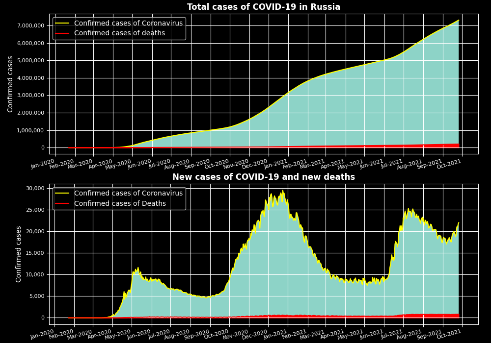

# Covid-19_visualization :mask:
This python file enables to get several interactive plots of COVID-19 using matplotlib:
* Data for Russia:
  * Total cases and total deaths
  * New cases and total deaths
* World statistics:
  * Top 10 countries with the highest number of confirmed COVID-19 cases
  * Top 10 countries with the highest number of deaths from COVID-19 

## Example of visualization (data as of 21/10/2021)
### COVID-19 data for Russia

  
Click to expand!

  
  > 

### World statistics

  
Click to expand!

 
  > 

